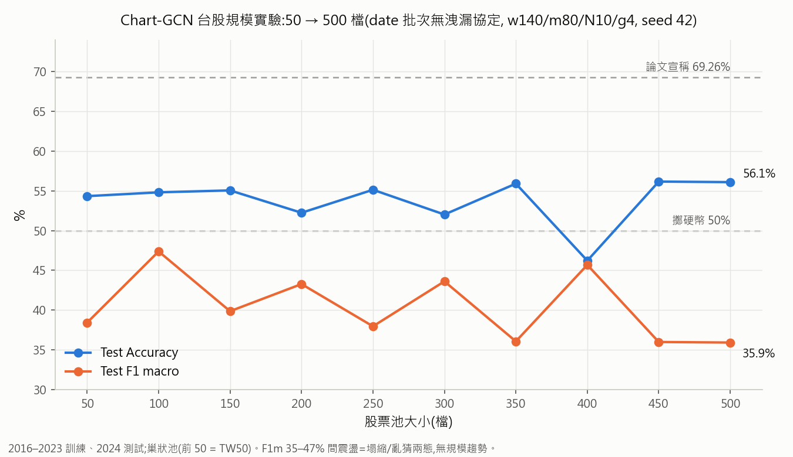

# 本週工作報告(2026/07/27)

## 本週主軸:提高檔數 + 分族群實驗

這禮拜的核心問題是:「**Chart-GCN 在台股的 ~50% 表現,能不能靠加更多股票、或改用同族群的股票來突破?**」
為此我們做了兩組系統性實驗,並在事前把評估協定修乾淨,確保數字可信。

---

## 一、前置:評估協定修正(讓本週所有數字都乾淨)

審查程式時發現:論文的 self-attention 對「同一批樣本」互相運算,原本依日期排序連續切 128 筆的做法,
會讓同一批混入「同股票的今天與明天」——明天樣本的輸入窗包含今天標籤的答案,等於間接看到未來。

實測同一顆模型只換評估批次:序向 128 筆 **52.70%** → 同日一批 **51.30%** → 一次一筆 **46.82%**。

→ 本週起標準協定改為 **date 批次(同日所有股票一批)**:無洩漏,且與論文「探索股票間關聯」的文字相容。
本報告以下所有數字都是這個乾淨協定下產生的(參數 w140/m80/N10/g4、raw 特徵、seed 42)。

## 二、提高檔數:50 → 500 檔規模實驗(10 輪)

作法:從證交所 ISIN 抓全部上市普通股,建立 **TW500 巢狀股票池**(554 檔;前 50 檔 = 原 TW50,
每次加 50 檔直到 500,每輪獨立訓練並記錄)。

| 檔數 | 50 | 100 | 150 | 200 | 250 | 300 | 350 | 400 | 450 | 500 |
|---|---|---|---|---|---|---|---|---|---|---|
| Acc(%) | 54.3 | 54.8 | 55.1 | 52.2 | 55.1 | 52.0 | 55.9 | 46.2 | 56.2 | 56.1 |
| F1 macro(%) | 38.4 | 47.4 | 39.9 | 43.3 | 38.0 | 43.6 | 36.1 | 45.7 | 36.0 | **35.9** |

**結果:訓練樣本從 9 萬增加到 88.5 萬(10 倍),完全沒有改善趨勢。**
Acc 的高值只是大池子「跌」類比例較高的假象;F1 macro 在「全押跌(~36%)」和「均衡亂猜(~47%)」
兩態之間震盪;500 檔時模型甚至一張「漲」的預測都不出。回測 10 輪有 9 輪輸給等權買入持有。

## 三、分族群:電子族群盤點與四組實驗

先從證交所產業別盤點:台灣上市電子相關族群共 **455 檔**
(電子零組件 104、半導體 96、光電 68、電腦週邊 64、其他電子 46、通信網路 45、電子通路 21、資訊服務 11)。

假說:同族群連動性強,「同日橫斷面 attention」在同質池上應該更有意義。四組實驗:

| 族群 | 檔數 | Acc | F1 macro | 回測超額 | 形態 |
|---|---|---|---|---|---|
| 全電子 | 450 | 51.29% | 51.22% | +0.4% | 均衡 ≈ 亂猜(歷來最高 F1m) |
| 半導體 | 92 | 44.85% | 38.24% | -11.6% | 反向塌縮(全押漲) |
| 電子零組件 | 104 | 49.33% | 48.91% | -3.8% | 均衡亂猜 |
| 金融保險(對照) | 32 | 54.16% | 39.09% | -18.4% | 塌縮(全押跌) |

**結果:分族群也不改變天花板。** 沒有任何一組同時做到「Acc 明顯高於類別先驗 + 預測均衡」;
同質性最高的半導體反而最差。

## 四、本週其他完成事項(簡列)

- XGBoost 同條件對照:乾淨協定下 Chart-GCN 與 XGB 同水準(F1m 38 vs 39,都塌縮)。
- 論文全網格 31 組在乾淨協定下重掃:val F1m 全在 0.47~0.53 噪音帶,調無可調。
- 論文原文逐條核對:批次定義、正規化、卷積通道數等論文皆未明定,已建立「論文明定 vs 自行補齊」清單。
- 工程:修復回測管線的批次協定傳遞、清理 7.7GB 冗餘檔案、重寫 README、文件全面重整。

## 五、結論

**否證鏈四維完整:換市場 ✗、掃參數 ✗、加資料量(10 倍)✗、分族群 ✗。**
無洩漏協定下,Chart-GCN 在 1 日漲跌標籤上與 XGBoost、擲硬幣無法區分——
瓶頸是「1 日 close-to-close 標籤的資訊含量」,不是模型、參數、資料量或股票組成。

## 六、下一步(待討論)

1. 換更可預測的題目:5 日標籤(降噪)、橫斷面相對強弱標籤。
2. 回到融合主軸:main(AE+OCSVM)× Chart-GCN。
3. 引入新資訊源(籌碼/分點)——價格衍生特徵的資訊已證明不足。

---
*操作方式見同資料夾 `操作文檔.md`;完整實驗數據見 repo 根目錄 `實驗記錄_論文對齊.md`。*
